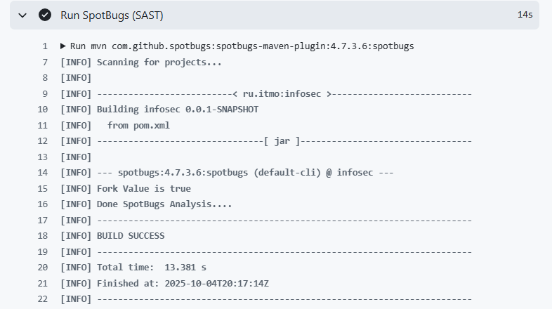
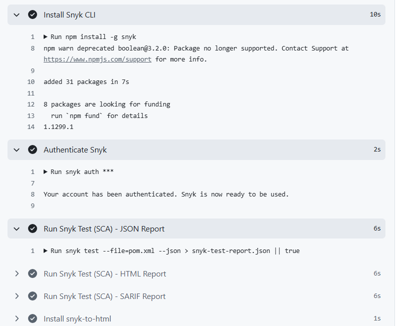

# Информационная безопасность. Лабораторная работа 1

## Описание проекта

Этот проект демонстрирует создание безопасного backend-приложения с помощью Java + Spring Boot, который включает:
- аутентификацию пользователей
- управление постами
- Защиту от таких атак, как SQL-инъекции, XSS-атаки, Broken Authentication

## API Endpoints

### POST `/auth/login`
Аутентификация пользователя.

**URL:** `http://localhost:8080/auth/login`

**Метод:** POST

**Headers:**
```
Content-Type: application/json
```

**Request Body:**
```json
{
  "username": "testuser",
  "password": "SecurePass123!"
}
```

**Успешный ответ (200 OK):**
```json
{
  "token": "eyJhbGciOiJIUzI1NiJ9...",
  "expirationTime": 1736766123456,
  "user": {
    "id": 1,
    "username": "testuser"
  }
}
```

**Пример вызова (curl):**
```bash
curl -X POST "http://localhost:8080/auth/login" \
  -H "Content-Type: application/json" \
  -d '{
    "username": "testuser",
    "password": "SecurePass123!"
  }'
```

### 2. GET `/api/posts` - Получение всех постов
**URL:** `http://localhost:8080/api/data`

**Метод:** GET

**Headers:**
```
Authorization: Bearer <JWT_TOKEN>
Content-Type: application/json
```

**Успешный ответ (200 OK):**
```json
{
  "posts": [
    {
      "id": 18,
      "title": "Final Test",
      "content": "Last post for testing purposes.",
      "authorUsername": "testuser",
      "authorId": 1
    },
    {
      "id": 17,
      "title": "Safety First",
      "content": "Security is our top priority.",
      "authorUsername": "testuser",
      "authorId": 1
    },
    {
      "id": 16,
      "title": "Tech Update",
      "content": "New features have been deployed.",
      "authorUsername": "testuser",
      "authorId": 1
    },
    {
      "id": 15,
      "title": "User Feedback",
      "content": "Thank you for using our API!",
      "authorUsername": "testuser",
      "authorId": 1
    },
    {
      "id": 14,
      "title": "Admin News",
      "content": "Latest updates from administration.",
      "authorUsername": "testuser",
      "authorId": 1
    },
    {
      "id": 13,
      "title": "Quick Tip",
      "content": "Always validate user input.",
      "authorUsername": "testuser",
      "authorId": 1
    },
    {
      "id": 12,
      "title": "Security Guide",
      "content": "Important security practices for developers.",
      "authorUsername": "testuser",
      "authorId": 1
    },
    {
      "id": 11,
      "title": "Welcome Post",
      "content": "Welcome to our secure API!",
      "authorUsername": "testuser",
      "authorId": 1
    }
  ],
  "count": 8,
  "message": "Posts retrieved successfully"
}
```

**Пример вызова (curl):**
```bash
curl -X GET "http://localhost:8080/api/data" \
  -H "Authorization: Bearer <JWT_TOKEN>" \
  -H "Content-Type: application/json"
```

### 3. DELETE `/auth/logout` - Выход
**URL:** `http://localhost:8080/auth/logout`

**Метод:** DELETE

**Headers:**
```
Authorization: Bearer <JWT_TOKEN>
Content-Type: application/json
```

**Успешный ответ (200 OK):**
```json
{
  "message": "Successfully logged out",
  "timestamp": "1736766123456"
}
```

**Пример вызова (curl):**
```bash
curl -X DELETE "http://localhost:8080/auth/logout" \
  -H "Authorization: Bearer <JWT_TOKEN>" \
  -H "Content-Type: application/json"
```

## Реализованные меры защиты

### 1. Защита от SQL-инъекций

**Методы защиты:**
- **Spring Data JPA (Hibernate)** с использованием параметризованных запросов.

### 2. Защита от XSS

**Методы защиты:**
- Сервер возвращает только json и не генерирует html/js

### 3. Защита от нарушений аутентификации

**JWT (JSON Web Tokens) реализация:**

**Методы защиты:**
- **Хеширование паролей**: BCrypt
- **Безопасные JWT токены**: HMAC SHA-256 подпись

### 4. Контроль доступа

**Методы защиты:**
- **JWT токены**: Обязательная аутентификация для защищенных endpoint'ов
- Filter-based security: Защита endpoint'ов через цепочку фильтров Spring Security

## Отчёты SAST/SCA





